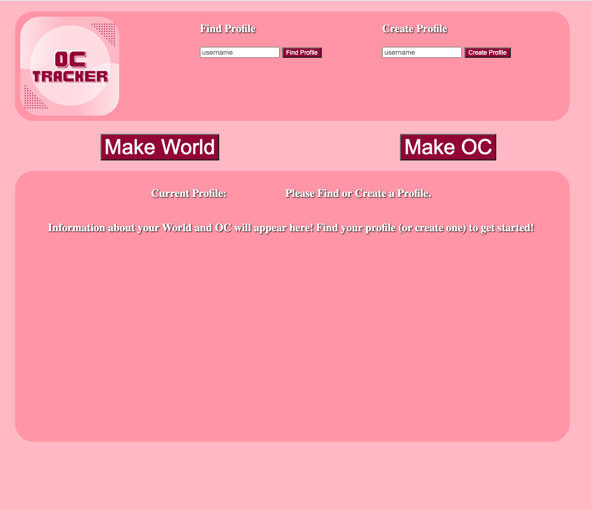

# OC_Tracker
### By: Theresa Kennelly

## Welcome to my Project!

## Welcome to OC Tracker!

This OC Tracker showcases the full stack development skills I have gained through the first half of General Assembly's Web Development Immersive program. This program is intended to help Writers, TTRPG Players, and anyone with creative minds not only keep track of their Original Characters, but also catagorize them by their home worlds.

By the end of this project there were still a few things I wanted to do, specifically, be able to recall all information contained in the World seed and in the OC seed. This will hopefully be something I impliment in the future. I also had much grander plans for the UI, but I plan to hone my CSS skills as much as possible to eventually make this app look the way it does in my imagination.

## Tech

JavaScript: Used to display results in table form.

HTML: Used to build the frame of the site as well as all the forms for getting/posting info.

CSS: Used to make things look nice (kind of).
Mongoose: Used to make and store the custom API.

## Wire Frame 
- (https://www.figma.com/file/eccJz2SO9yl4wVu89KlcWA/Project-2?type=design&node-id=0%3A1&t=o5JboxLWQprdOLEs-1)

